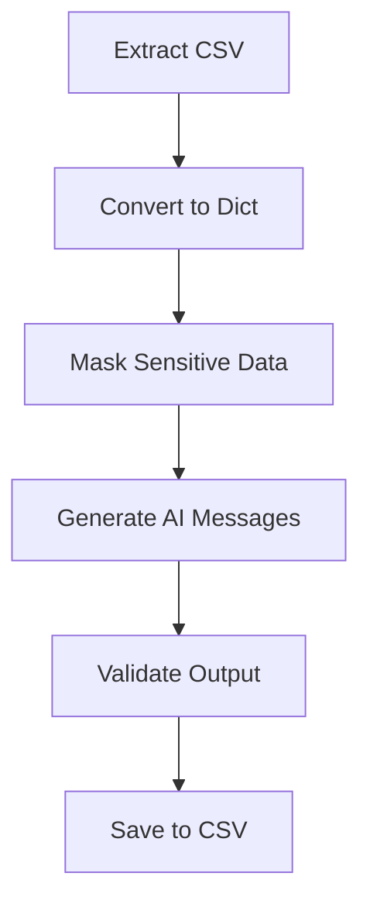

# AI‑Powered ETL Pipeline for Personalized Marketing Messages

## 📌 Overview
This project demonstrates a complete **ETL (Extract, Transform, Load) pipeline** built with Python and Pandas, enhanced with AI-generated personalized marketing messages.

It simulates a real-world data workflow used in marketing analytics, including data extraction from CSV files, data masking for privacy, transformation logic, AI integration, and structured output generation.

Originally developed as a bootcamp exercise, the project was expanded into a professional portfolio project with improved structure, validation, and automation.

---

## 🚀 Project Objectives
- Build an end-to-end ETL pipeline using Python and Pandas
- Apply data cleaning, validation, and masking techniques
- Integrate AI to generate personalized marketing messages
- Simulate real-world data engineering and analytics workflows
- Export enriched data into a structured output file

---

## 🔄 ETL Workflow

### 1️⃣ Extract
- Load customer data from a CSV file
- Convert data into structured Python objects

### 2️⃣ Transform
- Mask sensitive information (e.g., account and card numbers)
- Validate and clean data
- Generate personalized marketing messages using an AI API
- Handle errors and invalid records gracefully

### 3️⃣ Load
- Export the processed data into a new CSV file
- Ensure only valid and enriched records are saved

---

## 🧠 Technologies Used

- Python  
- Pandas  
- OpenAI API (AI message generation)
- Jupyter Notebook  
- GitHub  

---

## 📊 ETL Flowchart



---

## 📁 Project Structure

```text
AI_marketing_ETL_pipeline/
│── data/
│   └── clients.csv
│
│── notebooks/
│   └── etl_notebook.ipynb
│
│── src/
│   └── etl_script.py
│
│── output/
│   └── marketing_messages.csv
│
│── README.md
│── requirements.txt
```

---

## 🧪 How to Run the Project

1. Install dependencies:
   ```
   pip install -r requirements.txt
   ```

2. Add your OpenAI API key in the script.

   Add your OpenAI API key in the script or as an environment variable.
   
4. Run the ETL script:
   ```
   python src/etl_script.py
   ```

5. Output

   The generated file will be saved in:
   ```
   output/marketing_messages.csv
   ```

---

## 📊 Example Use Cases

- Marketing analytics and personalization
- Data engineering pipelines
- Data quality and privacy simulations 
- AI integration in data workflows 

---

## 🎯 Key Learnings

- Designing scalable ETL pipelines 
- Data cleaning, validation, and masking
- AI integration in analytics workflows 
- Error handling and automation  
- Structuring projects for professional portfolios

---

## 👩‍💻 Author

**Amanda Batista**

Junior Data Analyst focused on Python, SQL, Excel, and Power BI.

LinkedIn: https://www.linkedin.com/in/amandabat

GitHub: https://github.com/amandajbatista7-design
