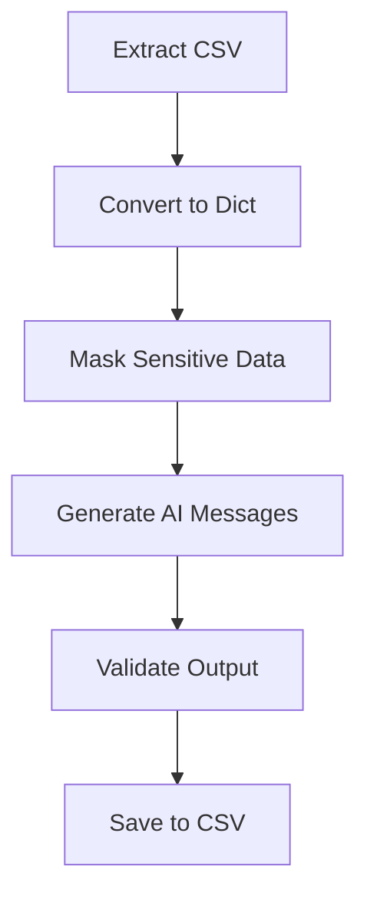

# AI‑Powered ETL Pipeline for Personalized Marketing Messages

This project demonstrates a complete ETL (Extract, Transform, Load) pipeline using Python, Pandas, and the OpenAI API.  
It loads customer data from a CSV file, masks sensitive information, generates personalized marketing messages using AI, and exports the results into a new CSV file.
This project began as a bootcamp exercise and was expanded significantly into a full AI‑powered ETL pipeline, including data masking, error handling, and automated message generation.

---

## 🚀 Project Overview

This project simulates a real-world data workflow used in marketing analytics:

1. **Extract**  
   - Load customer data from a CSV file  
   - Convert it into a structured dictionary format  

2. **Transform**  
   - Mask sensitive fields (account numbers, card numbers)  
   - Use the OpenAI API to generate personalized marketing messages  
   - Handle errors gracefully  

3. **Load**  
   - Save the enriched dataset into a new CSV file  
   - Ensure only valid rows are exported  

---

## 🧠 Technologies Used

- Python  
- Pandas  
- OpenAI API  
- Jupyter Notebook  
- GitHub  

---

## 📊 ETL Flowchart



---

## 📁 Project Structure

```
├── clients.csv
├── marketing_messages.csv
├── etl_script.py
├── etl_notebook.ipynb
└── README.md
```

---

## 🧪 How to Run

1. Install dependencies:
   ```
   pip install pandas openai
   ```

2. Add your OpenAI API key in the script.

3. Run the ETL script:
   ```
   python etl_script.py
   ```

4. The output file `marketing_messages.csv` will be generated.

---

## 🎯 What I Learned

- Building a full ETL pipeline  
- Masking sensitive data  
- Integrating AI into data workflows  
- Error handling and data validation  
- Preparing a project for a professional portfolio  

---

## 📬 Contact

Created by **Amanda**  
Let’s connect on [LinkedIn](https://www.linkedin.com/in/amandabat/)